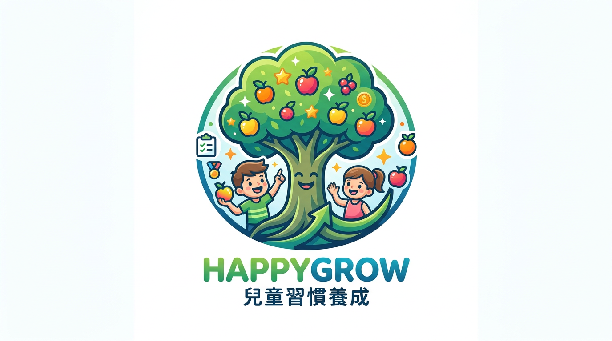

# 成就丛林 (Achievement Jungle)



一款游戏化儿童习惯养成应用。家长为孩子设置每日习惯目标，孩子完成打卡后由家长审核，审核通过后虚拟树木成长并获得果实奖励，果实可在商店兑换实际奖励。

> 当前版本：**v3.8**

## 技术栈

| 层级 | 技术 |
|------|------|
| 前端 | React 19 + TypeScript + Vite 6 + TailwindCSS v4 + motion/react |
| 路由 | React Router v7（路由级代码分割 + 懒加载） |
| 后端 | Node.js + Express 4 + TypeScript |
| 数据库 | Supabase (PostgreSQL) |
| 认证 | Supabase Auth（邮箱登录 + 密码找回 + 自动 Token 续签） |
| 部署 | Vercel Serverless Functions（前后端一体） |
| 包管理 | pnpm |
| PWA | Service Worker + Web App Manifest（可安装到主屏幕） |

## 功能概览

### 核心功能

- 🌳 **森林主页**（`/forest`）：树木成长可视化，支持本月 / 上季度 / 过去一年统计筛选；月度打卡日历；月度任务总结成就单
- ✅ **每日打卡**（`/`，首页）：孩子提交打卡，支持补打卡（选择历史日期）；家长审核通过后树木自动成长
- 🎯 **目标设置**（`/add-goal`）：创建 / 编辑 / 删除习惯目标，支持独立任务与多孩子共享任务两种模式
- 🏅 **勋章系统**（`/medals`）：根据累计任务、连续打卡等条件自动解锁勋章，可查看获取时间和解锁条件
- 🛒 **果实商店**（`/store`）：用果实兑换家长设置的实际奖励；支持果实获取记录和兑换历史查询
- 💬 **消息中心**（`/messages`）：家长与孩子互动，系统自动发送审核通知
- 📊 **每日进度**：登录后自动弹窗展示每个孩子的今日任务完成情况（每天仅显示一次）

### 家长管理

- 👨‍👩‍👧 **家长审核**（`/parent-control`）：批准 / 拒绝 / 撤销任务，支持额外奖励果实；多孩子二级 Tab 筛选；实时待审核角标提示
- 🎁 **奖品管理**（`/rewards-management`）：创建 / 编辑奖品，查看兑换记录，支持撤回待发放兑换
- 👶 **儿童模式**：家长一键开启，限制孩子访问管理功能，切换需密码二次确认

### 体验增强

- 🤝 **共享任务**：多孩子共同参与同一任务竞争，先完成者获得奖励，实时进度排名（`/shared-task/:goalId`）
- 🌙 **深色模式**：支持系统偏好或手动切换，全页面适配
- 📱 **PWA 支持**：可安装到 Android / iOS 主屏幕，支持离线缓存
- 🔄 **下拉刷新**：所有数据页面支持下拉手势刷新
- 📐 **响应式布局**：手机底部导航栏 / 桌面左侧边栏自动切换，支持 4 列网格

---

## 文档导航

| 文档 | 说明 |
|------|------|
| [快速开始](docs/getting-started.md) | 安装依赖、配置 Supabase、初始化数据库、启动开发服务器 |
| [项目结构](docs/project-structure.md) | 目录结构说明、前后端架构设计 |
| [数据库设计](docs/database.md) | 业务表的字段说明和关系 |
| [核心业务逻辑](docs/business-logic.md) | 树木成长、审核触发链、勋章系统、时间筛选统计 |
| [API 参考](docs/api-reference.md) | 完整 API 端点列表（含请求/响应示例） |
| [部署指南](docs/deployment.md) | Vercel + Supabase 一体化部署步骤 |
| [在线用户手册](/doc/) | 部署后可访问 /doc 查看功能介绍和使用指南 |

---

## 路由结构

| 路径 | 页面 | 说明 |
|------|------|------|
| `/` | CheckIn | **首页**，每日打卡（需登录） |
| `/forest` | Dashboard | 成长树森林 + 打卡日历（需登录） |
| `/messages` | Messages | 消息中心（需登录） |
| `/medals` | Medals | 勋章成就墙（需登录） |
| `/store` | Store | 果实商店（需登录） |
| `/store/fruits-history` | FruitsHistory | 果实获取记录（需登录） |
| `/store/redemption-history` | RedemptionHistory | 兑换历史（需登录） |
| `/profile` | Profile | 个人中心（需登录） |
| `/parent-control` | ParentControl | 家长审核（需登录） |
| `/rewards-management` | RewardsManagement | 奖品管理（需登录） |
| `/add-goal` | GoalSetting | 目标设置（需登录） |
| `/shared-task/:goalId` | SharedTaskSummary | 共享任务总结（需登录） |
| `/login` | Login | 登录 |
| `/register` | Register | 注册 |
| `/forgot-password` | ForgotPassword | 密码找回 |

---

## 快速启动

```bash
# 安装依赖
pnpm install
pnpm --prefix server install

# 配置环境变量（参考 docs/getting-started.md）
cp .env.example .env.local

# 初始化数据库（在 Supabase SQL Editor 中执行以下单一文件即可）
# supabase/migrations/init.sql

# 启动开发服务器（前后端同时启动）
pnpm start
```

详细步骤请参阅 [快速开始文档](docs/getting-started.md)。

---

## PWA 安装

| 平台 | 安装方式 |
|------|---------|
| Android Chrome | 访问网站后地址栏出现"添加到主屏幕"提示，点击即可 |
| iOS Safari | 点击分享按钮 → "添加到主屏幕" |
| 桌面 Chrome/Edge | 地址栏右侧安装图标，或菜单中"安装应用" |

---

## 更新日志

完整的版本更新历史请参阅 [CHANGELOG.md](CHANGELOG.md)。

### 最近更新

#### v3.8 — 待审核角标、分类优化与图标标签

为家长端新增待审核任务实时角标提示，优化任务分类图标，并在目标设置图标选择器中显示类别名称。

- ✅ **新增** `src/contexts/PendingTasksContext.tsx`：全局待审核任务数 Context
- ✅ **新增** `src/hooks/usePendingTasksCount.ts`：封装 `usePendingTasks` 的便捷 Hook
- ✅ **修改** `src/components/Navigation.tsx`：家长中心导航项新增红色数字角标
- ✅ **修改** `src/views/Profile.tsx`：家长审核入口新增红色数字角标
- ✅ **修改** `src/views/CheckIn.tsx`：打卡成功后立即刷新角标
- ✅ **修改** `src/views/ParentControl.tsx`：审核操作后角标实时同步

**无需数据库迁移**：纯前端功能优化

#### v3.7 — 共享任务功能

多个孩子可以共同参与同一个任务的竞争，先完成者获得奖励。

- ✅ **新增** `supabase/migrations/011_add_shared_goals.sql`：`goals` 表新增 `is_shared` 和 `shared_child_ids` 字段
- ✅ **新增** `src/views/SharedTaskSummary.tsx`：共享任务总结页，展示所有参与孩子的进度排名
- ✅ **新增** 后端接口 `GET /api/v1/goals/:goalId/shared-progress`
- ✅ **修改** 目标创建/编辑支持共享任务模式，日历金色叶子高亮共享打卡日期

**数据库迁移**：执行 `supabase/migrations/011_add_shared_goals.sql`

#### v3.4 — 认证系统全面升级（Supabase Auth）

将自定义 JWT 认证体系全面迁移至 Supabase Auth 原生方案。

- ✅ 登录/注册均使用真实邮箱，会话由 Supabase Auth 自动管理
- ✅ 密码找回通过邮件链接完成
- ✅ 后端使用 `service_role` 密钥，可绕过 RLS 直接访问数据

**数据库迁移**：执行 `supabase/migrations/010_migrate_to_supabase_auth.sql`
