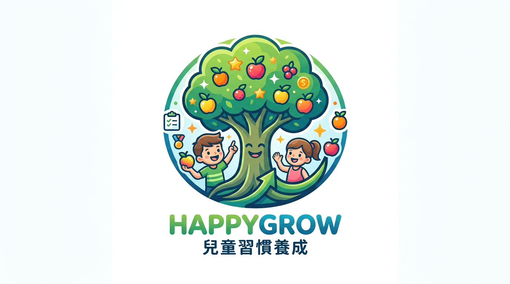

# 成就丛林 (Achievement Jungle)



一款游戏化儿童习惯养成应用。家长为孩子设置每日习惯目标，孩子完成打卡后由家长审核，审核通过后虚拟树木成长并获得果实奖励，果实可在商店兑换实际奖励。

> 当前版本：**v3.8**

## 技术栈

| 层级 | 技术 |
|------|------|
| 前端 | React 19 + TypeScript + Vite 6 + TailwindCSS v4 + motion/react |
| 路由 | React Router v7（路由级代码分割 + 懒加载） |
| 后端 | Node.js + Express 4 + TypeScript |
| 数据库 | Lighthouse MySQL 8（业务数据 + 认证数据） |
| 认证 | Express 自建认证（bcrypt + JWT + MySQL 会话） |
| 部署 | 腾讯云 Lighthouse（Nginx + PM2 + Express） |
| 包管理 | pnpm |
| PWA | Service Worker + Web App Manifest（可安装到主屏幕） |

## 功能概览

### 核心功能

- 🌳 **森林主页**（`/forest`）：树木成长可视化，支持本月 / 上季度 / 过去一年统计筛选；月度打卡日历；月度任务总结成就单
- ✅ **每日打卡**（`/`，首页）：孩子提交打卡，支持补打卡（选择历史日期）；家长审核通过后树木自动成长
- 🎯 **目标设置**（`/add-goal`）：创建 / 编辑 / 删除习惯目标，支持独立任务与多孩子共享任务两种模式
- 🏅 **勋章系统**（`/medals`）：根据累计任务、连续打卡等条件自动解锁勋章，可查看获取时间和解锁条件
- 🛒 **果实商店**（`/store`）：用果实兑换家长设置的实际奖励；支持果实获取记录和兑换历史查询
- 💬 **消息中心**（`/messages`）：家长与孩子互动，系统自动发送审核通知
- 📊 **每日进度**：登录后自动弹窗展示每个孩子的今日任务完成情况（每天仅显示一次）

### 家长管理

- 👨‍👩‍👧 **家长审核**（`/parent-control`）：批准 / 拒绝 / 撤销任务，支持额外奖励果实；多孩子二级 Tab 筛选；实时待审核角标提示
- 🎁 **奖品管理**（`/rewards-management`）：创建 / 编辑奖品，查看兑换记录，支持撤回待发放兑换
- 🏅 **勋章管理**（`/medals/manage`）：家长创建 / 编辑 / 删除成就勋章，支持图标、渐变色和 6 种解锁条件（累计打卡、连续打卡、早起打卡等）配置，实时预览勋章样式
- 👶 **儿童模式**：家长一键开启，限制孩子访问管理功能，切换需密码二次确认

### 体验增强

- 🤝 **共享任务**：多孩子共同参与同一任务竞争，先完成者获得奖励，实时进度排名（`/shared-task/:goalId`）
- 🌙 **深色模式**：支持系统偏好或手动切换，全页面适配
- 📱 **PWA 支持**：可安装到 Android / iOS 主屏幕，支持离线缓存
- 🔄 **下拉刷新**：所有数据页面支持下拉手势刷新
- 📐 **响应式布局**：手机底部导航栏 / 桌面左侧边栏自动切换，支持 4 列网格

---

## 文档导航

| 文档 | 说明 |
|------|------|
| [快速开始](docs/getting-started.md) | 安装依赖、配置 MySQL、启动本地开发服务器 |
| [项目结构](docs/project-structure.md) | 目录结构说明、前后端架构设计 |
| [数据库设计](docs/database.md) | 业务表的字段说明和关系 |
| [核心业务逻辑](docs/business-logic.md) | 树木成长、审核触发链、勋章系统、时间筛选统计 |
| [API 参考](docs/api-reference.md) | 完整 API 端点列表（含请求/响应示例） |
| [部署指南](docs/deployment.md) | 腾讯云 Lighthouse + MySQL 8 部署步骤 |
| [在线用户手册](/doc/) | 部署后可访问 /doc 查看功能介绍和使用指南 |

---

## 路由结构

| 路径 | 页面 | 说明 |
|------|------|------|
| `/` | CheckIn | **首页**，每日打卡（需登录） |
| `/forest` | Dashboard | 成长树森林 + 打卡日历（需登录） |
| `/messages` | Messages | 消息中心（需登录） |
| `/medals` | Medals | 勋章成就墙（需登录） |
| `/medals/manage` | MedalManagement | 勋章管理（需登录，家长权限） |
| `/store` | Store | 果实商店（需登录） |
| `/store/fruits-history` | FruitsHistory | 果实获取记录（需登录） |
| `/store/redemption-history` | RedemptionHistory | 兑换历史（需登录） |
| `/profile` | Profile | 个人中心（需登录） |
| `/parent-control` | ParentControl | 家长审核（需登录） |
| `/rewards-management` | RewardsManagement | 奖品管理（需登录） |
| `/add-goal` | GoalSetting | 目标设置（需登录） |
| `/shared-task/:goalId` | SharedTaskSummary | 共享任务总结（需登录） |
| `/login` | Login | 登录 |
| `/register` | Register | 注册 |
| `/forgot-password` | ForgotPassword | 密码找回 |

---

## 快速启动

### 本地开发

```bash
# 安装依赖
pnpm install
pnpm --prefix server install

# 配置环境变量（参考 .env.tencent.example 和 docs/getting-started.md）
cp .env.tencent.example .env.local

# 腾讯云分支初始化业务数据库（只对空库执行一次）
chmod 600 .env.local
pnpm db:import:tencent /path/to/littletreesql_backup

# 启动开发服务器（前后端同时启动）
pnpm start
```

本地前端地址为 `http://localhost:3000`，后端地址为 `http://localhost:3001`。Vite 会将 `/api` 请求代理到后端；浏览器不会直接连接 MySQL。

详细的本地配置请参阅 [快速开始文档](docs/getting-started.md)。

### 腾讯云 Lighthouse

`tencent-cloud` 分支在腾讯云上的运行入口是 Lighthouse 上的 Nginx + PM2 + Express，不依赖 Supabase 或 Vercel 运行时：

```text
浏览器 → Nginx :8081 → dist 静态文件
                    └→ /api/* → Express/PM2 :3002 → MySQL :3306（仅本机）
```

当前服务器配置如下：

| 组件 | 配置 |
|------|------|
| 项目目录 | `/opt/littletreecheckin` |
| 前端入口 | Nginx `8081`，静态文件位于 `/var/www/littletreecheckin` |
| 后端进程 | PM2 `littletreecheckin-api`，Express 监听 `127.0.0.1:3002` |
| 数据库 | Lighthouse 本机 MySQL 8，监听 `127.0.0.1:3306` |
| 数据库备份 | `/opt/littletreecheckin/db-backup` |

服务器首次初始化时，在项目根目录准备 `.env.local`（参考 [.env.tencent.example](.env.tencent.example)），只填写数据库连接、JWT 密钥和运行参数，并执行 `chmod 600 .env.local`。不要把密码、JWT 密钥或其他凭据提交到 Git。

只在空数据库上执行一次业务数据导入；认证账号导入会保留原 UUID 和业务数据关联：

```bash
cd /opt/littletreecheckin
pnpm db:import:tencent /opt/littletreecheckin/db-backup
pnpm auth:import:tencent
```

`auth:import:tencent` 需要在服务器终端交互输入三个迁移账号的初始密码。初次登录后应立即修改密码。不要重复执行业务备份导入，否则可能产生主键冲突。

每次发布或更新代码时执行部署脚本。脚本会安装依赖、运行类型检查和测试、构建前后端、更新 Nginx 配置并重载 PM2：

```bash
cd /opt/littletreecheckin
LITTLETREE_ROOT=/opt/littletreecheckin \
LITTLETREE_WEB_PORT=8081 \
LITTLETREE_API_PORT=3002 \
deploy/deploy.sh
```

部署后可用命令行检查服务：

```bash
curl -fsS http://127.0.0.1:3002/health
curl -fsSI http://127.0.0.1:8081/
curl -sS -i http://<Lighthouse公网IP>:8081/api/v1/auth/me
pm2 list
sudo nginx -t
```

未携带令牌访问 `/api/v1/auth/me` 时返回 `401` 是预期结果；这同时可以确认 Nginx 到 Express 的反向代理已接通。当前服务器已验证 HTTP 前端和 API 代理可用，但尚未配置 `443` HTTPS。正式对外使用前，需要备案域名、SSL 证书和 HTTPS Nginx 配置，并启用安全 Cookie；在此之前不要启用生产支付或依赖 HTTPS 的功能。

完整的服务器初始化、数据库迁移、HTTPS 和故障排查步骤请参阅 [腾讯云部署指南](docs/deployment.md)。

---

## PWA 安装

| 平台 | 安装方式 |
|------|---------|
| Android Chrome | 访问网站后地址栏出现"添加到主屏幕"提示，点击即可 |
| iOS Safari | 点击分享按钮 → "添加到主屏幕" |
| 桌面 Chrome/Edge | 地址栏右侧安装图标，或菜单中"安装应用" |

---

## 更新日志

完整的版本更新历史请参阅 [CHANGELOG.md](CHANGELOG.md)。

### 最近更新

#### v3.8 — 待审核角标、分类优化与图标标签

为家长端新增待审核任务实时角标提示，优化任务分类图标，并在目标设置图标选择器中显示类别名称。

- ✅ **新增** `src/contexts/PendingTasksContext.tsx`：全局待审核任务数 Context
- ✅ **新增** `src/hooks/usePendingTasksCount.ts`：封装 `usePendingTasks` 的便捷 Hook
- ✅ **修改** `src/components/Navigation.tsx`：家长中心导航项新增红色数字角标
- ✅ **修改** `src/views/Profile.tsx`：家长审核入口新增红色数字角标
- ✅ **修改** `src/views/CheckIn.tsx`：打卡成功后立即刷新角标
- ✅ **修改** `src/views/ParentControl.tsx`：审核操作后角标实时同步

**无需数据库迁移**：纯前端功能优化

#### v3.7 — 共享任务功能

多个孩子可以共同参与同一个任务的竞争，先完成者获得奖励。

- ✅ **新增** 共享目标数据库字段：`goals` 表新增 `is_shared` 和 `shared_child_ids`
- ✅ **新增** `src/views/SharedTaskSummary.tsx`：共享任务总结页，展示所有参与孩子的进度排名
- ✅ **新增** 后端接口 `GET /api/v1/goals/:goalId/shared-progress`
- ✅ **修改** 目标创建/编辑支持共享任务模式，日历金色叶子高亮共享打卡日期

**数据库迁移**：腾讯云分支初始化时由 `server/db/schema.sql` 一次性创建

#### v3.4 — 认证系统全面升级（历史版本）

该版本曾将认证体系迁移至外部认证服务；`tencent-cloud` 分支现已改为 Express + MySQL 自建认证。

- ✅ 登录/注册使用真实邮箱和 bcrypt 密码哈希
- ✅ access token + refresh session 由 Express 和 MySQL 管理
- ✅ 密码重置 token 只保存哈希，使用一次后失效

**数据库迁移**：腾讯云分支执行 `pnpm db:import:tencent`，认证表由 `server/db/schema.sql` 创建
